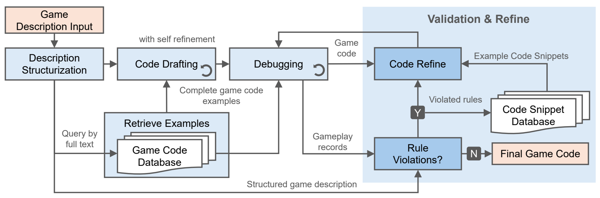

# Cardiverse: Harnessing LLMs for Novel Card Game Prototyping

[](https://arxiv.org/abs/2502.07128) [](https://opensource.org/licenses/MIT) [](https://www.python.org/downloads/release/python-312/) [](https://pypi.org/project/uv/) [](https://2025.emnlp.org/)


*(Banner art drafted by Gemini Nano-Banana)*

Cardiverse is an LLM-powered framework for rapid card game prototyping. It:

* Generates **📊 novel game mechanics** via graph-based indexing.
  
* Produces **💻 consistent game code** validated by gameplay records.

* Builds **🤖 scalable gameplay AI** through self-play–optimized heuristics.
  

We also present an **🃏 LLM Gameplay AI Arena** for card games, supporting a diverse set of gameplay AI agents ranging from baseline strategies (random, human) to advanced reasoning agents (CoT, ReAct, Reflexion, our methods).


### Table of Contents
- [Installation](#installation)
- [Game Mechanic Generation](#game-mechanic-generation)
- [Game Code Generation](#game-code-generation)
- [GameplayAI Generation](#gameplayai-generation)
- [LLM Gameplay AI Arena](#llm-gameplay-ai-arena)
---

## Installation

We use `uv` to manage the virtual environment. To set up the environment, run:

```bash
uv sync
```

Remember to set your OpenAI API key in the environment:

```bash
export OPENAI_API_KEY="your_api_key"
```

## Game Mechanic Generation

We propose an indexing method that represents games as mechanic graphs, providing a global view of existing databases to guide design. This approach enables the creation of novel game variations that are intentionally distinct from prior designs.


> We are still organizing the code and instructions for game mechanic generation. We hope to release it by the end of November 2025.

## Game Code Generation

We employ an LLM-based agent system that generates game code from a given description and iteratively refines it by validating against self-generated gameplay records.




### 🚀 Usage

1. Preprocess the example game code library for retrieval-augmented generation:

    ```bash
    python -m GameCode.retrieval.prepare_indexing --source data/code_generation/example_lib
    ```
    
    Then you should see the files in `data/code_generation/example_lib/indexing`:
    ```
    ├── game1.md
    ├── game1.py
    ├── game2.md
    ├── game2.py
    └── ...
    ```

1. Test the game code generation pipeline on a single game description.

    ```bash
    python create_game_code.py --configs data/code_generation/configs/recommended.yaml --test_run
    ```

    Then you should see the logging info such as:
    ```
    2025-09-07 21:58:38,862 - Running in test mode, only the first task will be executed.
    2025-09-07 21:58:41,646 - Creating game code for emperor in thread MainThread
    2025-09-07 21:58:41,647 - Using the provided game description string for emperor
    ...
    2025-09-07 22:07:24,249 - Validation result for emperor-a218169c55524c57b3922a2511be5bff: True
    2025-09-07 22:07:29,377 - Validation result for emperor-a218169c55524c57b3922a2511be5bff: True
    2025-09-07 22:07:29,413 - Successfully generated a working game code for emperor after 3 edits
    ```

    And the generated game will be saved in:
    ```
    ├── your_output_dir/
    │   ├── process.log     # log file for code generation
    │   ├── game/
    │   │   └── emperor.py             # generated game code
    │   ├── temp/
    │   │   ├── emperor_llm_chat.log   # LLM chat log
    │   │   ├── emperor.md             # structurized game description
    │   │   └── ...
    ```

2. To multi-process the game code generation for all games in the config file, run:
    ```bash
    python create_game_code.py --configs data/code_generation/configs/recommended.yaml
    ```

### 📂 Create your own games

1. Prepare your own example game code library for better retrieval-augmented generation.
    ```bash
    python -m GameCode.retrieval.prepare_indexing --source data/your_example_library
    ```

2. Prepare your configuration file. You can copy from `data/code_generation/configs/recommended.yaml` and modify it.

## GameplayAI Generation

Our work generates an ensemble of heuristic code functions as gameplay AI, optimized by self-play. It achieves similar performance as LLM agents with **NO** test-time LLM costs.


### 🚀 Usage

Run the script directly from the command line:

```bash
python create_gameplay_ai.py --folder_path data/gameplay_ai_generation/examples --policy_num 4
```

Arguments:
- **`--folder_path`** *(str, default=`data/gameplay_ai_generation/examples`)*
  Path to the directory containing game folders. Each game folder should have a `.md` and `.py` file.
- **`--policy_num`** *(int, default=`4`)*
  Number of base policies to generate for each game.


When you run the script, you’ll see logs like:
```
INFO:GameplayAI:Creating agent for GinRummy
INFO:GameplayAI:Optimizing weights for GinRummy Round 1
INFO:GameplayAI:Optimizing weights for GinRummy Round 2
INFO:GameplayAI:Time usage for GinRummy: {"propose_and_code": 1200, "optimize": 2500}
```


After running the script, for each game (e.g., `GinRummy`), the folder will look like:

```
your_game_directory/
├── GinRummy/
│   ├── GinRummy.md         # Game description (prepared manually or using our work)
│   ├── GinRummy.py         # Game code (prepared manually or using our work)
│   ├── ai/                 # Gameplay policy and code
│   │   ├── policy_text.json
│   │   └── ...
│   ├── time.json           # Runtime stats
│   └── usage.json          # Token usage stats
```
### 📂 Prepare your own game AIs

Prepare the game folders. Each game folder should contain a `.md` file with the game description and a `.py` file with the game code. You can use our generated games or prepare your own.

Example structure:
```
your_game_directory/
 ├── GinRummy/
 │   ├── GinRummy.md         # Game description (prepared manually or using our work)
 │   └── GinRummy.py         # Game code (prepared manually or using our work)
 ├── Uno/
 │   ├── Uno.md
 │   └── Uno.py
 └── ...
```


## LLM Gameplay AI Arena

Our arena supports a variety of gameplay AI agents, ranging from simple baselines to advanced LLM-driven strategies. We also support human-in-the-loop gameplay via terminal interaction.

| Gameplay AI Agent | Description |
|------------------------|-------------|
| `RandomAgent`          | Randomized strategy agent |
| `HumanAgent`           | Human player agent, where you can be a part of the game in terminal |
| `HEAgent` | Our proposed work (heuristics ensemble agent) |
| `HEA-NoOpt`            | Ablation without optimizing heuristic selection |
| `HEA-NoEns`            | Ablation without heuristic ensemble |
| `CoTAgent`             | Chain-of-Thought reasoning agent |
| `ReActAgent`           | ReAct (reasoning + acting) agent |
| `ReflexionAgent`       | Reflexion-based learning agent |
| `RuleAgent`            | Rule-based strategy; supported only for `uno`, `gin_rummy`, `leduc_holdem` |


In total, 22 card games are supported, spanning Rummy, Casino, Trick-Taking, and Other categories.
This mix covers traditional casino games, family games, trick-taking classics, and varied versions that are generated by our work.

| Genre      | Game Name                |   | Genre            | Game Name                 |
| ---------- | ------------------------ | - | ---------------- | ------------------------- |
| **Rummy**  | Boat House Rum           |   | **Trick Taking** | California Jack           |
|            | Gin Rummy                |   |                  | Crazy Eights              |
| **Casino** | Baccarat                 |   |                  | Uno                       |
|            | Bull Poker               |   |                  | Go Boom                   |
|            | Cincinnati Poker         |   |                  | Hearts                    |
|            | Cincinnati Liz Poker     |   |                  | Hearts (Varied)           |
|            | Fan Tan                  |   |                  | Hollywood Eights (Varied) |
|            | Fan Tan (Varied)         |   | **Other**        | Go Fish                   |
|            | In-Between               |   |                  | Linger Longer             |
|            | Liberty Fan Tan (Varied) |   |                  | Go Fish (Varied)          |
|            | Leduc Hold’em            |   |                  | I Doubt it (Varied)       |
|            |                          |   |                  |                           |


Run single or multiple evaluation rounds for card games with interchangeable **attack** and **defense** agents (LLM-driven, heuristic, rules, random, or human-in-the-loop). Supports optional game logging, CSV result aggregation, and Reflexion-style training.

### 🚀 Quick start

Human vs Random in Uno. It means **YOU** will play the game against computer players by inputting commands in the terminal!

```bash
python -m GameplayAI.run_game --game uno --attack_agent HumanAgent --defense_agent RandomAgent
```

Tip: When `--attack_agent HumanAgent` is selected, the CLI shows your legal actions and (when available) a “Hint” generated by the heuristic executor (HE) agent.

Random vs Random in Uno, appending final game results to a CSV

```bash
python -m GameplayAI.run_game --game uno --attack_agent RandomAgent --defense_agent RandomAgent --output_csv output.csv
```

HeuristicEnsembleAgent vs ReAct in Leduc Hold’em, saving game log and appending results to CSV, with fixed seed

```bash
python -m GameplayAI.run_game --game leduc_holdem --attack_agent ReActAgent --defense_agent HEAgent --log --output_csv output.csv --seed 42
```

ReflexionAgent vs CoTAgent in Gin Rummy with logs and training. OpenAI API key must be set in the environment for LLM-based agents.

```bash
python -m GameplayAI.run_game --game gin_rummy --attack_agent ReflexionAgent --defense_agent CoTAgent --log --training
```


### 🔧 Command detail

```bash
python -m GameplayAI.run_game [OPTIONS]
```

#### Required arguments

Although defaults exist in code, these three are parsed as **required**.


| Flag              | Type  | Choices                                                                                                                   | Description                                              |
| ----------------- | ----- | ------------------------------------------------------------------------------------------------------------------------- | -------------------------------------------------------- |
| `--game`          | `str` | `uno`, `leduc_holdem`, `gin_rummy`, …                                                                                     | **Game name** (must match a folder and file in `--dir`). |
| `--defense_agent` | `str` | `RandomAgent`, `CoTAgent`, `ReActAgent`, `ReflexionAgent`, `HEAgent`, `RuleAgent`, `HEA-NoOpt`, `HEA-NoEns`               | **Defense** agent type.                                  |
| `--attack_agent`  | `str` | `RandomAgent`, `HumanAgent`, `HEAgent`, `HEA-NoOpt`, `HEA-NoEns`, `CoTAgent`, `ReActAgent`, `ReflexionAgent`, `RuleAgent` | **Attack** agent type.                                   |


#### Optional arguments

| Flag           | Type            | Description                                                                                                       |
| -------------- | --------------- | ----------------------------------------------------------------------------------------------------------------- |
| `--dir`        | `str`           | Root directory containing game assets. The script expects `<dir>/<game>/<game>.py` and `<dir>/<game>/<game>.txt`. |
| `--llm_model`  | `str`           | Model ID passed to `LLMHandler` (used by CoT/ReAct/Reflexion and any LLM-backed loaders). Model ID naming follows OpenAI's API documentation.                         |
| `--run_num`    | `int`           | Number of rounds to play in this session.                                                                         |
| `--seed`       | `int` or `None` | Random seed forwarded to the environment factory.                                                                    |
| `--log`        | flag            | If set, write a game log per run.                                                                                 |
| `--log_path`   | `str` or `None` | Path for the log file. If omitted but `--log` is set, a `<game>_play_<timestamp>.log` is used.                    |
| `--training`   | flag            | Enable Reflexion post-game `reflect(...)` updates for any `ReflexionAgent` in the env.                            |
| `--output_csv` | `str` or `None` | Append results per run to a CSV file you specify. Created on first run if missing.                                |


### 🔍 Batch evaluation

Generate a batch evaluation script for all games in a directory, excluding specific games (e.g., `uno`), with specified attack and defense agents, number of runs, output CSV file, and LLM model.

```bash
python GameplayAI/utils/batch_generate_eval.py --root_path data/gameplay_ai_generation/examples --exclude_games uno --script_path eval_batch.sh --defense_agents RandomAgent --attack_agents RandomAgent ReActAgent --run_num 100 --output_csv results.csv --llm_model gpt-4o-mini
```

Then run the generated script:

```bash
bash eval_batch.sh
```

## Replicability Notice

In our paper, we used the game descriptions from a third party (https://bicyclecards.com/how-to-play) as inputs to: 
- Evaluate game code generation pipeline, and
- Evaluate our gameplay AIs versus prior LLM agents. 

However, we are not allowed to redistribute these contents due to Fair Use policies. 
To provide an alternative data source, the game descriptions we include in this repository are manually crafted with the assistance of ChatGPT. The game rules are manually verified to largely align with the game descriptions we used in the paper, but the difference in language may lead to some discrepancies in the generated gameplay AIs and their performance.

To more strictly replicate our results, please manually download the game descriptions from the source. Then you replace the game description markdown files in the following directories with the downloaded files:
- `data\code_generation\example_lib`
- `data\gameplay_ai_generation\examples`

You should strictly follow the local laws and regulations when using these materials.

## Attributions

This repository uses code snippets from the following open-source projects:
- RLCard (https://github.com/datamllab/rlcard)
- Agentless (https://github.com/OpenAutoCoder/Agentless?tab=readme-ov-file)


## Citation
If you find our work useful in your research, please consider citing:
```bibtex
@misc{li2025cardiverse,
      title={Cardiverse: Harnessing LLMs for Novel Card Game Prototyping}, 
      author={Danrui Li and Sen Zhang and Sam S. Sohn and Kaidong Hu and Muhammad Usman and Mubbasir Kapadia},
      year={2025},
      eprint={2502.07128},
      archivePrefix={arXiv},
      primaryClass={cs.CL},
      url={https://arxiv.org/abs/2502.07128}, 
}
```